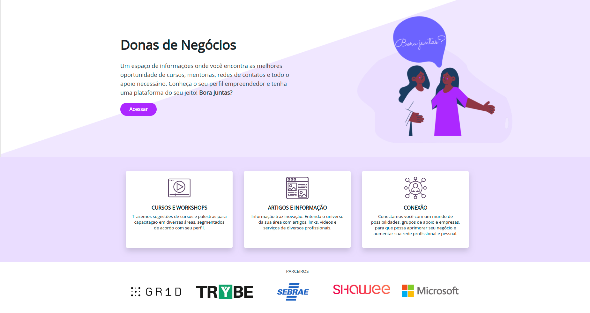

# Protótipo MHW - Desafio Sebrae - Time 6

Desafio do time 6 no Mega Hack Women 2020.

Protótipo web do portal **Bora Juntas?**, solução desenvolvida para desafio ao Sebrae.

Link navegável do Heroku: [https://mhw-time-6.herokuapp.com/](https://mhw-time-6.herokuapp.com/)

## Time 6:

- Halane Gonzaga @noubh
- Simone Simonetti @monymachado
- Ingrid Queiroz @ingridq
- Juliana Souza @juh
- Nayara Gomes @nayaramcp

## Tecnologias

- Laravel Framework
- VueJS Framework
- Tailwind CSS

## APIs

- Gr1d
- ReceitaWS
- ViaCep

## Instalação

Instalar dependências com composer:

    git clone url.git mhw-time6
    cd mhw-time6
    composer install

Instalar chaves:

    php artisan keys:generate

Iniciar serviço:

    php artisan serve